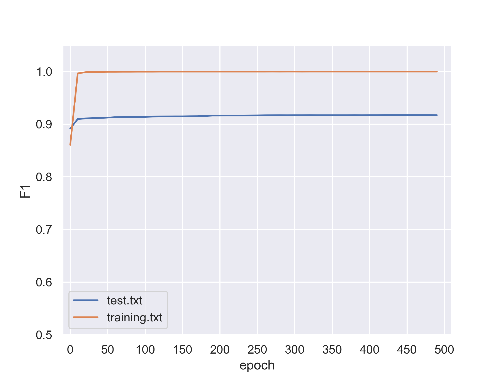

# 谜切 SegMisty

谜切是一个中文分词代码库，目前内置最大匹配、隐马尔可夫、二元语法、结构化感知机、CRF++（仅特征工程）等分词算法。

如未有特殊说明，结果在pku训练集上训练，在pku测试集上测试。

## 分词效果

|              | F1        | R     | P     | OOV   | IV    |
| ------------ | --------- | ----- | ----- | ----- | ----- |
| 最大匹配     | **0.876** | 0.909 | 0.845 | 0.069 | 0.961 |
| HMM          | **0.629** | 0.522 | 0.792 | 0.227 | 0.540 |
| 带规则二元语法  | **0.920** | 0.934 | 0.907 | 0.373 | 0.968 |
| 无规则二元语法  | **0.886** | 0.921 | 0.854 | 0.069 | 0.973 |
| 结构化感知机 | **0.929** | 0.918 | 0.940 | 0.577 | 0.939 |
| CRF++        | **0.932** | 0.926 | 0.942 | 0.638 | 0.944 |

## 最大匹配

分别实现最大前向、后向、双向匹配。

实现文件：`mm.py`

测试结果：`fmm_result.txt`，`rmm_result.txt`，`bimm_result.txt`

测试得分：`fmm_score.txt`，`rmm_score.txt`，`bimm_score.txt`

## HMM

实现了HMM训练以及预测。

实现文件：`hmm.py`

测试结果：`hmm_result.txt`

测试得分：`hmm_score.txt`

## 二元语法

实现了二元语法模型训练以及预测。

实现文件：`bigram.py`

测试结果：`bigram_result.txt`，`bigram_no_rules_result.txt`

测试得分：`bigram_score.txt`，`bigram_no_rules_score.txt`

## 结构化感知机

实现了结构化感知机训练及预测。

实现文件：`perceptron.py`

训练模型结果：`pku-440iters-F1-0.929.perceptron` 来自440次参数更新迭代，f1值0.929

训练模型f1图像:

测试结果：`perceptron_result.txt`

测试得分：`perceptron_score.txt`

## CRF++

实现了数据集文本和CRF++序列之间的双向转换。

实现文件：`utils.py`

特征模版：`crfpp_template.txt`

训练模型结果：`crfpp_trained_model` 基于上述特征模版

测试结果：`crfpp_result.txt`

测试得分：`crfpp_score.txt`

